# 👻 GhostBuster-PC

> **GhostBuster-PC is a high-performance, cross-platform utility and glassmorphic desktop dashboard designed to identify and safely terminate orphaned, windowless background processes that silently hoard system resources. By surgically reclaiming leaked RAM from zombie instances of browser engines, runtime environments, and IDE helper processes, it instantly restores system performance without disrupting your active workspace.**

<p align="center">
  <a href="demo.mp4" target="_blank">
    
  </a>
</p>

---

## ✨ Features

- **🧠 Smart Window-Detection Heuristic (Windows):** Uses native Win32 APIs via `ctypes` (no extra packages) to verify if a process or any of its ancestors owns an active, visible window. If a window is visible, the app is left untouched; if it's running completely headless/orphaned, it's flagged as a ghost.
- **🐧 Cross-Platform Fallback:** Automatically switches to terminal-association and parent-status heuristics on macOS and Linux platforms.
- **🎨 Elite Developer Interface:** Features a styled ANSI console layout with an ASCII banner and auto-aligning tables that dynamically scale to terminal widths.
- **⚡ Safe Termination Flow:** Attempts a graceful termination (`SIGTERM` / `WM_CLOSE` equivalent) and escalates to forceful termination (`SIGKILL`) if processes ignore signals or hang.
- **🛠️ Parametric CLI Controls:** Easily configure thresholds, customize target lists, or automate cleanups via command-line arguments.

---

## 🚀 Fast Installation & Usage

### 1. Clone & Install Dependencies
First, ensure you have Python 3.8+ installed. Then, clone this repository and install the requirements:
```bash
git clone https://github.com/yourusername/GhostBuster-PC.git
cd GhostBuster-PC
pip install -r requirements.txt
```

### 2. Launch the Desktop Dashboard UI 🖥️
Run the launcher script to experience the minimalist glassmorphic dashboard:
```bash
python gui.py
```
This starts a background daemon server and opens the dashboard inside a native frameless desktop window (or falls back to your default web browser if webview packages are missing).
- **Scanner Radar:** Visual indicator that pulses while scanning.
- **Dynamic Gauges:** Interactive circular progress indicator showing total reclaimable memory.
- **Micro-Animations:** Fluid slide-out animations on killing individual tasks or performing a "Clean All" sweep.

### 3. Run via CLI (Developer Mode) 💻
Execute the terminal script directly to scan for default ghost applications (Chrome, Edge, Node, Java, Discord, VS Code) consuming over 20 MB:
```bash
python ghostbuster.py
```

### 4. Advanced CLI Options
GhostBuster comes equipped with command-line arguments to adapt to different developer environments:
```bash
# Set a custom memory threshold of 50 MB
python ghostbuster.py --threshold 50

# Scan custom processes (e.g., Firefox and Python helper scripts)
python ghostbuster.py --targets firefox,python

# Run in auto-confirm mode (perfect for Cron jobs, Windows Scheduler, or background scripts)
python ghostbuster.py --yes

# Perform a dry-run to see what would be terminated without making any changes
python ghostbuster.py --dry-run
```

### 5. Compiling into an Executable (.exe) 📦
To package the dashboard into a standalone executable that you can launch with a double-click without requiring Python installed:
```bash
pyinstaller --onefile --noconsole --add-data "index.html;." gui.py
```
*Note: The built executable will be located in the `dist/` directory.*

> **Note:** Running the utility inside an Administrator (Windows) or Root (Linux/macOS) terminal/prompt is recommended to clean up elevated background services, though standard users can still clean up their own user-space background processes.

---

## 🗺️ ECSoC 45-Day Open-Source Roadmap

GhostBuster-PC is designed for scalability. Below is our **Summer of Code** roadmap outlining future milestones and architectural expansions:

```mermaid
gantt
    title ECSoC 45-Day Open-Source Roadmap
    dateFormat  X
    axisFormat %d
    section Phase 1 (Days 1-15)
    Desktop GUI Dashboard (Delivered)  :done, 0, 15
    section Phase 2 (Days 16-30)
    System Tray Daemon & Auto-Triggers  :active, 15, 30
    section Phase 3 (Days 31-45)
    Custom Configurations & Config Manager GUI : 30, 45
```



### 🔴 Phase 1 (Days 1–15): Desktop GUI Implementation (Delivered)
- **Goal:** Elevate GhostBuster from a CLI utility to a user-friendly desktop application.
- **Scope (Completed):** 
  - Developed a sleek, glassmorphic desktop interface utilizing HTML/CSS/JS and `pywebview`.
  - Designed a real-time memory visualizer displaying a circular progress bar of reclaimable RAM.
  - Implemented single-click sweep actions, individual process termination hooks, and custom threshold range filters with smooth CSS animations.

### 🟡 Phase 2 (Days 16–30): Daemon Mode & Automated Triggers
- **Goal:** Run GhostBuster in the background as a lightweight system service.
- **Scope:**
  - Build a background worker utilizing system tray integrations (`pystray` library) so the app stays in the system tray when closed.
  - Implement dynamic polling that monitors overall RAM usage.
  - Add configurable threshold alarms (e.g., "automatically purge ghost processes when total system RAM usage exceeds 90% or when a target process runs windowless for over 30 minutes").

### 🟢 Phase 3 (Days 31–45): Configuration Manager GUI & Exclusions File
- **Goal:** Introduce deep user personalization and custom white-listing profiles.
- **Scope:**
  - Implement `.ghostbuster.json` or YAML configuration management to store persistent custom whitelist rules, custom target lists, and auto-purge frequency.
  - Design a config-editor panel inside the dashboard to allow user-friendly updates to targets and whitelisted directories directly from the GUI.

---

## 📄 License
This project is licensed under the **MIT License**. Check out `LICENSE` for more details.
